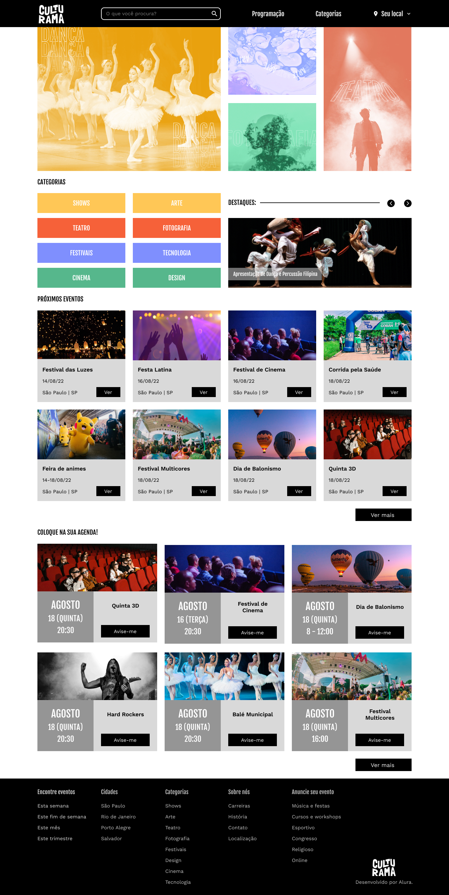

<h1 align="center"> CULTURAMA </h1>

Programa exclusivo promovido pela ALURA com o objetivo de trabalhar todas as habilidades em GRID e FLEXBOX  

  <a href="#-tecnologias">Tecnologias</a>&nbsp;&nbsp;&nbsp;|&nbsp;&nbsp;&nbsp;
  <a href="#-projeto">Projeto</a>&nbsp;&nbsp;&nbsp;|&nbsp;&nbsp;&nbsp;
  <a href="#-layout">Layout</a>&nbsp;&nbsp;&nbsp;|&nbsp;&nbsp;&nbsp;
  <a href="#memo-licença">Licença</a>

  

 

  

## 🚀 Tecnologias

Esse projeto foi desenvolvido com as seguintes tecnologias:

- HTML e CSS
- Git e Github
- Figma

## 💻 Projeto

O DevLinks é um agregador de links para usar como cartão de visitas online.

- [Acesse o projeto finalizado, online](https://saiko9x.github.io/culturama/)

## 🔖 Layout

Você pode visualizar o layout do projeto através [DESSE LINK](https://www.figma.com/file/mC6DmuXPGWHYkMWOQD3khm/2713---Praticando-CSS%3A-Grid-e-Flexbox?t=sKWwprdA8tqF42DS-0). É necessário ter conta no [Figma](https://figma.com) para acessá-lo.

## :memo: Licença

Esse projeto está sob a licença MIT.

---

Feito com ♥ by Saiko Dev :wave: [Participe da comunidade da Alura!](https://discord.com/invite/QeBdgAjXnn)
